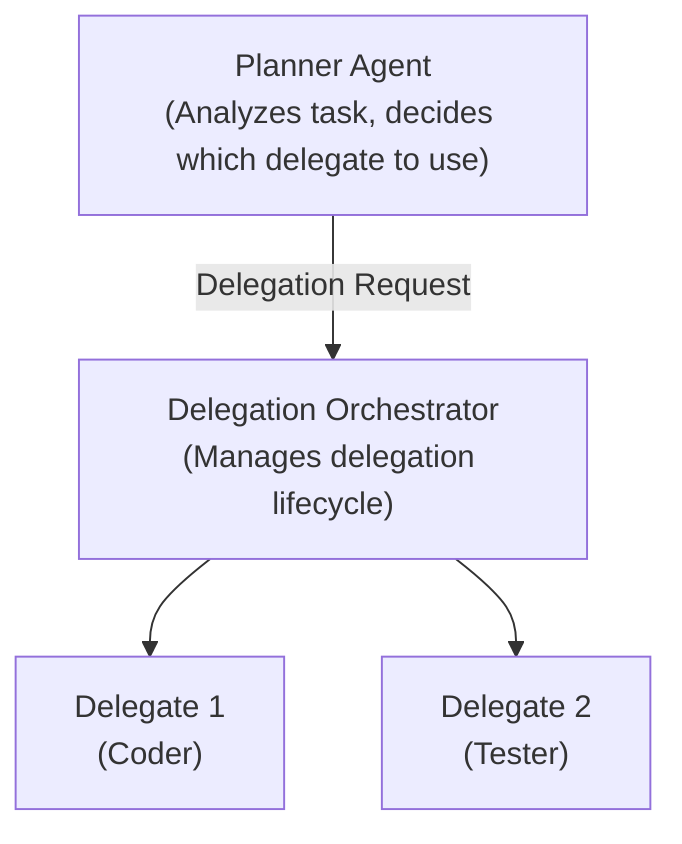

# QueryMT Agent - Delegation System

The delegation system enables multi-agent workflows where a planner agent can delegate tasks to specialized delegate agents. This allows for division of labor and specialized expertise.

## Overview

Delegation allows agents to:
- **Delegate tasks** to specialized agents
- **Coordinate work** across multiple agents
- **Verify results** from delegates
- **Run in parallel** multiple delegations
- **Route to remote agents** via mesh networking

## Architecture



## Configuration

### Enabling Delegation

Delegation is enabled in the quorum configuration:

```toml
[quorum]
delegation = true
verification = false  # Optional: enable verification
```

### Defining Delegates

```toml
[[delegates]]
id = "coder"
provider = "anthropic"
model = "claude-sonnet-4-5-20250929"
description = "Coder agent that implements code changes"
capabilities = ["coding", "filesystem", "shell"]
tools = ["edit", "write_file", "shell", "read_tool", "glob"]

system = """You are a coder agent. Implement the requested changes
efficiently and correctly. Focus on writing clean, maintainable code."""

[delegates.execution]
max_steps = 200
```

### Planner Configuration

```toml
[planner]
provider = "anthropic"
model = "claude-sonnet-4-5-20250929"
tools = ["delegate", "read_tool", "shell", "glob"]

system = """You are a planner agent. Your role is to:
1. Analyze user requests
2. Decide if delegation is needed
3. Choose the appropriate delegate
4. Provide clear instructions to delegates
5. Review and integrate delegate results"""
```

## Session-Scoped Delegate Models (ACP)

A delegate's profile configuration supplies its default model. A parent session can
explicitly override that model for **future delegations**, without changing the
profile, another parent session, or a child that is already running. The override
is read during child setup, before its first prompt; a change racing with setup
is not guaranteed to affect that already-starting child.

### Read assignments

Check `querymt/capabilities` for `querymt/session/delegateModels` and
`querymt/session/setDelegateModel`. Call:

```json
{"method":"querymt/session/delegateModels","params":{"session_id":"parent-session-id"}}
```

An illustrative result is:

```json
{
  "version": 1,
  "reasoning_effort_supported": true,
  "session_id": "parent-session-id",
  "profile_id": "quorum",
  "revision": 2,
  "durable": true,
  "editable": true,
  "assignments": [
    {
      "agent_id": "coder",
      "name": "Coder",
      "description": "Writes code",
      "model": {"model_id": "provider/model", "node_id": "mesh-node-id"},
      "source": "override",
      "configured_default_model_id": "provider/default-model",
      "reasoning_effort": "high"
    }
  ],
  "orphaned_overrides": []
}
```

- `model` is the stored override, or `null` to inherit. It is returned even if the
  model has disappeared from the current catalog or its node is offline.
- `source` is `override` or `profile_default`. A failed read is **unknown**, not
  proof of inheritance. Do not substitute a recent/default catalog entry.
- `configured_default_model_id` is the local delegate's configured provider/model,
  also included by `querymt/profile/agents`. It may be `null` for a remote delegate.
  It is **not** a resolved Mesh route, a runtime availability guarantee, or the model
  that generated an existing child's messages.
- `reasoning_effort_supported` is true when the additive setter/readback field is
  available. Clients must hide reasoning controls when an older backend omits it.
- `reasoning_effort` is `null` to inherit the parent session at delegation time, or
  `auto`, `low`, `medium`, `high`, or `max` for an explicit role override.
- `orphaned_overrides` contains `{agent_id, model, reasoning_effort}` entries for
  removed profile roles. Model can be `null` for reasoning-only overrides. They
  remain visible and can be explicitly cleared; reads never delete them.
- `editable` is false for delegated child sessions. User-created forks can own
  independent assignments. The session must have a valid persisted profile binding;
  no prior actor load is required.

Reads do not set models, replay client preferences, or create session actors.

### Change one assignment

```json
{
  "method": "querymt/session/setDelegateModel",
  "params": {
    "session_id": "parent-session-id",
    "agent_id": "coder",
    "model_id": "provider/model",
    "node_id": "mesh-node-id",
    "reasoning_effort": "high",
    "expected_revision": 2
  }
}
```

The response includes `version`, `session_id`, `agent_id`, confirmed `model`,
`reasoning_effort`, `revision`, and `durable`. Every write must include `model_id`;
omitting it is `InvalidParams`. Omit `node_id` (or use `null`) for a local model.
Reset the model with an explicit `model_id: null` and no node. The optional
`reasoning_effort` field preserves the existing setting when omitted, clears it back
to parent-session inheritance when null, and accepts `auto`, `low`, `medium`, `high`,
or `max`. Snake-case request fields also accept their camelCase aliases. An empty
node string is rejected rather than silently selecting local execution.

Use the revision from readback to avoid lost updates. A stale write fails without
changing anything. The ACP error code is `-32020`, not `InvalidParams`
(`-32602`), with this error data:

```json
{
  "code": "delegate_assignment_conflict",
  "expected_revision": 2,
  "actual_revision": 3,
  "message": "Delegate assignments changed; refresh before retrying"
}
```

Refresh and let the user review a conflict; do not blindly retry. Writes to an
unchanged value keep the revision. The revision covers all roles in that parent
session; a changed role increments it once. Multiple setter calls are not an atomic
bulk operation: retain per-role confirmations and handle partial failure before
sending a new session's first prompt.

Older clients may omit `expected_revision`; their writes are unconditional but
atomically preserve other roles and any omitted reasoning setting. SQLite stores one
revision row per parent session and one relational override row per configured role;
there are no JSON assignment blobs. Deleting a parent cascades to its assignments. A
user fork copies assignments independently with revision zero; delegated children do
not inherit that assignment map.

### Notifications and recovery

On changes, stdio and WebSocket event streams send the advertised
`querymt/session/delegateModelsChanged` invalidation hint:

```json
{"method":"querymt/session/delegateModelsChanged","params":{"version":1,"session_id":"parent-session-id","revision":3}}
```

Notifications use existing session event routing/ownership rules. They are not a
cross-process database watcher or a guaranteed event for every commit: the write
and event publication are separate. Always read back on reconnect and refresh on
focus when other processes may write. The returned state, not an event history scan, is authoritative.

Delegation updates and load snapshots also expose `selectedModelId` and
`selectedProviderNodeId` once a child has been configured. These optional fields
come from that child's confirmed control state immediately before the fork event
and first prompt. Older fork events omit them. Use them for historical execution
provenance; do not rewrite them from today's parent assignment settings.

Custom `SessionStore` implementations that do not implement durable assignments
retain the legacy in-memory path. They report `durable: false` and `revision: null`,
and reject an `expected_revision`. Do not promise persistence or compare-and-swap
for those backends. Legacy in-memory overrides are not automatically migrated;
clients must explicitly apply any desired saved setup.

### Testing and database isolation

Profile tests must inject temporary or in-memory storage into `AgentInfra`; the
profile manager and its runtimes must use the same isolated storage. `storage: None`
means **use the normal user database**, not an in-memory test database.

As defense in depth, run tests with a fresh `QMT_SESSIONS_DB`, `QMT_HOME`, and
`HOME`, and use a filesystem sandbox that hides the real home and other worktrees.
Never launch development builds against a live sessions database to test migrations.
The delegate-assignment migration is `0017_delegate_assignments`, after the event
source identity and remote sync progress migrations already present on `main`.

## Delegation Lifecycle

### 1. Delegation Request

The planner decides to delegate and creates a delegation request.

If hooks are enabled, `pre_delegation` runs before the delegation is recorded. It can block the delegation entirely or rewrite fields such as `target_agent_id`, `objective`, `context`, `constraints`, and `expected_output`.

The planner-side tool result is updated when a delegation is blocked, so the model sees `Delegation blocked by hook: ...` instead of a misleading queued message.

The delegation request shape is:

```rust
pub struct Delegation {
    pub public_id: String,              // Unique delegation ID
    pub target_agent_id: String,        // Which delegate to use
    pub objective: String,              // What needs to be done
    pub context: Option<String>,        // Additional context
    pub constraints: Option<String>,    // Constraints to follow
    pub expected_output: Option<String>,// Expected result format
    pub task_id: Option<String>,        // Associated task ID
    pub planning_summary: Option<String>,// Summary of planning conversation
    pub verification_spec: Option<VerificationSpec>, // Optional verification
}
```

### 2. Session Creation

The orchestrator creates a new session for the delegate:

```rust
// Planner creates delegation session
let (session_id, session_ref) = target_agent
    .create_delegation_session(cwd)
    .await?;
```

### 3. Context Injection

The planner's context is injected into the delegate session.

If hooks are enabled, `delegation_start` runs just before the delegate begins work. This hook is observe-only: it cannot block execution, but its `additional_context` is appended to the child session planning context.

The planner's context is injected into the delegate session:

```rust
// Planning summary is injected via kameo message
session_ref
    .set_planning_context(planning_summary)
    .await?;
```

### 4. Task Execution

The delegate receives the task and begins execution:

```
Delegate receives:
  - Objective: "Add user authentication"
  - Context: [Planning summary]
  - Constraints: "Use JWT, follow security best practices"
  - Expected Output: "Working authentication with tests"

Delegate:
  - Analyzes requirements
  - Reads existing code
  - Implements changes
  - Writes tests
```

### 5. Result Collection

The delegate's work is collected.

If hooks are enabled, `post_delegation` runs after the delegate summary is extracted. This hook is observe-only and can append context to the summary that gets injected back into the planner session.

The delegate's work is collected:

```rust
// Get delegate's history
let history = session_ref.get_history().await?;

// Extract summary
let summary = extract_session_summary_from_history(&history);
```

### 6. Verification (Optional)

If verification is enabled, the result is verified:

```rust
if let Some(verification_spec) = &delegation.verification_spec {
    let passed = verification_service
        .verify(verification_spec, context)
        .await?;
    
    if !passed {
        // Delegation failed verification
        // Error is reported to planner
    }
}
```

### 7. Result Injection

The result is injected back into the planner session.

If a delegation fails, `delegation_failure` runs before the failure message is injected back into the planner. This hook is also observe-only and can append remediation context to the planner-visible failure message.

The result is injected back into the planner session:

```rust
let message = format_delegation_completion_message(
    &delegation.public_id,
    &summary
);

planner_session.prompt(message).await?;
```

## Delegation Hooks Summary

| Hook | Matcher | Behavior |
|---|---|---|
| `pre_delegation` | target agent regex | Block or rewrite the delegation before it is recorded |
| `delegation_start` | target agent regex | Observe start and append planning context for the child session |
| `post_delegation` | target agent regex | Observe completion and append context to the injected summary |
| `delegation_failure` | target agent regex | Observe failure and append context to the injected failure message |

See the [Hooks Guide](hooks.md) for JSON payloads, schemas, and output examples.

## Delegation Status

| Status | Description |
|--------|-------------|
| `Pending` | Delegation requested, waiting to start |
| `Running` | Delegate is working on the task |
| `Complete` | Delegate finished successfully |
| `Failed` | Delegate encountered an error |
| `Cancelled` | Delegation was cancelled |

## Verification

### Verification Types

```rust
pub enum VerificationType {
    // Run a shell command and check exit code
    ShellCommand { command: String },
    
    // Check if a file exists
    FileExists { path: String },
    
    // Check if file contains specific content
    FileContains { path: String, content: String },
    
    // Custom verification logic
    Custom { spec: serde_json::Value },
}
```

### Example Verification

```toml
# In delegate configuration
[[delegates]]
id = "coder"
# ... other config

# Verification spec in delegation request
verification_spec = {
    verification_type = "shell_command",
    command = "cargo check && cargo test"
}
```

## Delegation Parameters

### Wait Policy

Controls how the planner waits for delegate results:

```toml
[quorum]
delegation_wait_policy = "any"  # "all" | "any"
delegation_wait_timeout_secs = 120
```

- **any**: Continue when first delegate completes
- **all**: Wait for all delegates to complete

### Parallel Delegations

```toml
[quorum]
max_parallel_delegations = 5
```

Maximum concurrent delegations.

### Grace Period

```toml
[quorum]
delegation_cancel_grace_secs = 5
```

Time to wait for graceful cancellation before force abort.

## Remote Delegation

Delegates can run on remote mesh nodes:

```toml
# Mesh configuration
[mesh]
enabled = true
listen = "/ip4/0.0.0.0/tcp/9000"

[[mesh.peers]]
name = "gpu-server"
addr = "/ip4/192.168.1.100/tcp/9000"

# Remote delegate
[[delegates]]
id = "remote-coder"
provider = "anthropic"
model = "claude-sonnet-4-5-20250929"
description = "Coder on GPU server"
peer = "gpu-server"  # Routes LLM calls to remote node
tools = ["edit", "write_file", "shell"]
```

When `peer` is specified:
- LLM calls are routed to the remote node
- Tool execution happens locally
- Enables "remote model, local session" pattern

## Delegation Events

Agents emit events during delegation:

```rust
pub enum AgentEventKind {
    // Delegation lifecycle
    DelegationRequested { delegation: Delegation },
    SessionForked {
        parent_session_id: String,
        child_session_id: String,
        target_agent_id: String,
        origin: ForkOrigin,
        fork_point_type: ForkPointType,
        fork_point_ref: String,
        instructions: String,
    },
    DelegationCompleted {
        delegation_id: String,
        result: Option<String>,
    },
    DelegationFailed {
        delegation_id: String,
        error: String,
    },
    DelegationCancelled {
        delegation_id: String,
    },
}
```

## Programmatic Delegation

### Creating a Delegation

```rust
use querymt_agent::prelude::*;
use agent_client_protocol::Delegation;

let delegation = Delegation {
    public_id: uuid::Uuid::new_v4().to_string(),
    target_agent_id: "coder".to_string(),
    objective: "Implement user authentication".to_string(),
    context: Some("Project uses JWT for authentication".to_string()),
    constraints: Some("Follow security best practices".to_string()),
    expected_output: Some("Working auth with tests".to_string()),
    task_id: None,
    planning_summary: None,
    verification_spec: None,
};

// Request delegation
agent.delegate(delegation).await?;
```

### Subscribing to Delegation Events

```rust
let mut events = agent.subscribe_events();

while let Ok(event) = events.recv().await {
    match event.kind() {
        AgentEventKind::DelegationRequested { delegation } => {
            println!("Delegation requested: {}", delegation.objective);
        }
        AgentEventKind::DelegationCompleted { delegation_id, result } => {
            println!("Delegation {} completed: {:?}", delegation_id, result);
        }
        AgentEventKind::DelegationFailed { delegation_id, error } => {
            println!("Delegation {} failed: {}", delegation_id, error);
        }
        _ => {}
    }
}
```

## Error Handling

### Common Errors

| Error | Cause | Resolution |
|-------|-------|------------|
| `AgentNotFound` | Delegate not registered | Register delegate with correct ID |
| `SessionCreationFailed` | Cannot create delegate session | Check delegate configuration |
| `VerificationFailed` | Verification check failed | Fix the issue or adjust verification |
| `Timeout` | Delegation took too long | Increase timeout or optimize task |
| `Cancelled` | Delegation was cancelled | Retry or handle cancellation |

### Error Classification

The system classifies delegation errors:

```rust
// Patch Application Failure
// → Use read_tool to see current file state
// → Verify context lines match actual file

// Verification Failure  
// → Read verification error output
// → Fix compilation/test errors

// Invalid Working Directory
// → Do NOT specify workdir in patches
// → Verify file paths are correct

// Too Many Retries
// → Current approach not working
// → Try different strategy
```

## Best Practices

### When to Delegate

**Good candidates for delegation:**
- Well-defined, isolated tasks
- Tasks requiring specific expertise
- Parallelizable work
- Tasks with clear success criteria

**Poor candidates for delegation:**
- Highly ambiguous requirements
- Tasks requiring deep context
- Interactive, multi-turn tasks
- Tasks needing human judgment

### Writing Good Delegation Requests

1. **Clear objective**: Be specific about what needs to be done
2. **Relevant context**: Include necessary background information
3. **Explicit constraints**: List any requirements or restrictions
4. **Expected output**: Describe what success looks like
5. **Verification criteria**: If applicable, specify how to verify

### Planning for Delegation

1. **Break down tasks**: Split complex tasks into smaller delegations
2. **Order dependencies**: Plan delegation sequence
3. **Set expectations**: Clearly communicate goals to delegates
4. **Review results**: Always review delegate output before integrating

## Examples

### Simple Delegation

```toml
# Planner delegates coding task to coder
[planner]
tools = ["delegate"]

[[delegates]]
id = "coder"
tools = ["edit", "write_file", "shell"]
```

User: "Add a new API endpoint"
Planner: Delegates to coder with task details
Coder: Implements the endpoint
Planner: Reviews and integrates the changes

### Parallel Delegation

```toml
[[delegates]]
id = "frontend-coder"
tools = ["edit", "write_file"]

[[delegates]]
id = "backend-coder"
tools = ["edit", "write_file", "shell"]
```

User: "Implement feature X"
Planner: Delegates frontend to frontend-coder, backend to backend-coder
Both delegates work in parallel
Planner: Integrates both results

### Verification Example

```toml
[[delegates]]
id = "coder"
# ...

# Verification in delegation request
verification_spec = {
    verification_type = "shell_command",
    command = "cargo test --lib"
}
```

## Troubleshooting

### Delegation Not Starting

1. Check delegate is registered: `agent.agent_registry().list_agents()`
2. Verify delegate configuration is valid
3. Check for middleware errors
4. Review logs for delegation events

### Delegate Not Completing

1. Check delegate has necessary tools
2. Verify delegate can access required files
3. Check for infinite loops in delegate logic
4. Review timeout settings

### Verification Failing

1. Check verification command is correct
2. Verify delegate made expected changes
3. Adjust verification criteria if too strict
4. Review delegate output for issues

## Related Documentation

- [Configuration Guide](configuration.md) - Delegation configuration
- [Mesh Networking](mesh.md) - Remote delegation
- [API Reference](api_reference.md) - Delegation types
- [Agent Modes](agent_modes.md) - Mode-aware delegation