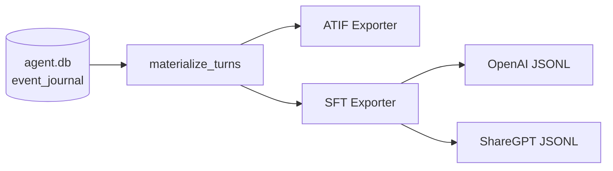

# Session Data Export

QueryMT Agent records every session interaction in its database (`~/.qmt/agent.db`). The export system lets you extract this data in standardized formats for analysis, compliance, and — most notably — **fine-tuning LLMs** on your own agent trajectories.

## Export Formats

### ATIF (Agent Trajectory Interchange Format)

The [ATIF v1.5](https://github.com/laude-institute/harbor) format exports sessions as structured agent trajectories with steps, tool calls, observations, and metrics. Useful for interoperability with other agent systems and trajectory analysis.

See the [`export_atif` example](#atif-export).

### SFT Training Data (JSONL)

Exports session data as JSONL files suitable for supervised fine-tuning (SFT). Two output formats are supported:

| Format | Description | Use with |
|--------|-------------|----------|
| `openai` | OpenAI chat completions format | OpenAI fine-tuning API, Axolotl, torchtune |
| `sharegpt` | ShareGPT conversation format | unsloth, LLaMA-Factory |

## Architecture

Both exporters share a common **turn materialization** layer that walks the event journal and produces structured `Turn` objects:



A `Turn` captures one complete LLM request/response cycle:

- User message (if any)
- Assistant text content
- Thinking/reasoning content (optional)
- Tool calls with arguments
- Tool results
- Model, provider, usage metrics, and cost

---

## SFT Export

### Quick Start

The fastest way to export is with the `export_sft` example:

```bash
# Show export stats (how much data you have)
cargo run --example export_sft -- --stats

# Export all sessions as OpenAI chat format
cargo run --example export_sft -- -o training.jsonl

# Export only Claude sessions as ShareGPT format
cargo run --example export_sft -- -f sharegpt --models claude-opus-4-6 -o training.jsonl
```

### CLI Options

```
export_sft [OPTIONS]

OPTIONS:
    --db <path>                Path to agent.db (default: ~/.qmt/agent.db)
    --output, -o <path>        Output file (default: stdout)
    --format, -f <fmt>         Output format: openai (default), sharegpt
    --stats                    Show export stats without writing data
    --min-turns <n>            Minimum LLM turns per session (default: 1)
    --max-tool-error-rate <r>  Max tool error rate 0.0-1.0 (default: 1.0)
    --models <m1,m2,...>       Only include sessions using these models
    --exclude-errored          Exclude sessions with error events
    --scrub-paths              Replace home directory paths with /workspace
    --include-thinking         Include thinking/reasoning content
    --no-tool-results          Omit tool result content (reduces size)
    --max-context <n>          Max context messages per example (default: 40)
    --no-context-limit         Include full conversation history
```

### HTTP API

When the agent server is running, the export is also available as a streaming HTTP endpoint:

```bash
# Download training data
curl "http://localhost:3000/api/export/sft?format=openai" -o training.jsonl

# With filters
curl "http://localhost:3000/api/export/sft?format=sharegpt&min_turns=3&models=claude-opus-4-6" \
  -o training.jsonl

# Preview stats only
curl "http://localhost:3000/api/export/sft?stats_only=true"
```

**Query Parameters:**

| Parameter | Type | Default | Description |
|-----------|------|---------|-------------|
| `format` | string | `openai` | Output format: `openai` or `sharegpt` |
| `min_turns` | int | `1` | Minimum LLM turns per session |
| `models` | string | all | Comma-separated model filter |
| `exclude_errored` | bool | `false` | Exclude sessions with errors |
| `max_tool_error_rate` | float | `1.0` | Max tool error rate (0.0-1.0) |
| `scrub_paths` | bool | `false` | Anonymize home directory paths |
| `include_thinking` | bool | `false` | Include reasoning content |
| `include_tool_results` | bool | `true` | Include tool result content |
| `max_context` | int | `40` | Max context messages per example |
| `stats_only` | bool | `false` | Return stats JSON instead of JSONL |

The endpoint streams JSONL with `Content-Type: application/x-ndjson` and sets `Content-Disposition: attachment` for browser downloads.

### Output Formats

#### OpenAI Chat Format

Each line is a JSON object with a `messages` array following the [OpenAI fine-tuning format](https://platform.openai.com/docs/guides/fine-tuning):

```json
{"messages": [
  {"role": "system", "content": "You are a coding assistant..."},
  {"role": "user", "content": "Read the file src/main.rs"},
  {"role": "assistant", "content": "", "tool_calls": [
    {"id": "call-1", "type": "function", "function": {"name": "read_tool", "arguments": "{\"path\":\"src/main.rs\"}"}}
  ]},
  {"role": "tool", "content": "fn main() { ... }", "tool_call_id": "call-1", "name": "read_tool"},
  {"role": "assistant", "content": "The file contains a main function that..."}
]}
```

#### ShareGPT Format

Each line uses the ShareGPT conversation format, compatible with [unsloth](https://github.com/unslothai/unsloth) and LLaMA-Factory:

```json
{"conversations": [
  {"from": "system", "value": "You are a coding assistant..."},
  {"from": "human", "value": "Read the file src/main.rs"},
  {"from": "gpt", "value": "The file contains a main function...\n<tool_call>\n{\"name\": \"read_tool\", \"arguments\": {\"path\":\"src/main.rs\"}}\n</tool_call>"},
  {"from": "tool", "value": "fn main() { ... }"},
  {"from": "gpt", "value": "The file contains a main function that..."}
]}
```

### Session Filtering

Filters control which sessions are included in the export. All filters are applied at the session level before any data is written.

**Minimum turns** (`--min-turns`): Skip sessions with fewer than N LLM turns. Useful for excluding trivial/test sessions.

**Model filter** (`--models`): Only include sessions that used specific models. Particularly useful for:

- **Distillation**: Export only Claude Opus sessions to fine-tune a smaller model on the strongest model's outputs.
- **Model-specific training**: Fine-tune a model on its own previous outputs (self-distillation/SSD).

**Error exclusion** (`--exclude-errored`): Skip sessions that contain error events.

**Tool error rate** (`--max-tool-error-rate`): Skip sessions where the proportion of failed tool calls exceeds the threshold. Value between 0.0 (no errors allowed) and 1.0 (all errors allowed).

### Context Windowing

Long sessions (100+ messages) would produce training examples that exceed model context limits. The `--max-context` option controls how many messages are included as context for each training example.

The algorithm:

1. The system message is always preserved (if present).
2. For each assistant response, include the last N messages as context.
3. Messages are kept on natural boundaries (complete tool call chains are not split).

Set `--no-context-limit` to include the full conversation history (use only if your training framework handles truncation).

### Path Scrubbing

The `--scrub-paths` option replaces home directory paths (e.g., `/Users/alice/projects/myapp`) with `/workspace`. This is useful when:

- Sharing training data across users or machines
- Preventing PII leakage in fine-tuned models
- Normalizing paths for consistent model behavior

---

## Fine-Tuning with Exported Data

The primary use case for the SFT export is **distillation** — training a smaller or local model on recorded outputs from a stronger model. For example, training a local Qwen 35B model on your Claude Opus session trajectories.

The exported data contains real, verified agent trajectories: multi-step reasoning, tool calls with arguments, tool results, and final responses that produced correct outcomes. This teaches the student model your specific tool-use patterns, coding style, and the agent's operational conventions.

### 1. Export training data

```bash
# Export Claude Opus sessions for distilling into a local model
cargo run --example export_sft -- \
  --models claude-opus-4-6 \
  --min-turns 3 \
  --scrub-paths \
  --format sharegpt \
  -o training.jsonl

# Check what you got
wc -l training.jsonl        # number of training examples
du -h training.jsonl         # file size
```

### 2. Fine-tune with unsloth

```python
from unsloth import FastLanguageModel

model, tokenizer = FastLanguageModel.from_pretrained(
    model_name="unsloth/Qwen3-30B-A3B",
    max_seq_length=8192,
    load_in_4bit=True,
)

model = FastLanguageModel.get_peft_model(model, r=16, lora_alpha=16)

from datasets import load_dataset
dataset = load_dataset("json", data_files="training.jsonl", split="train")

from trl import SFTTrainer, SFTConfig

trainer = SFTTrainer(
    model=model,
    train_dataset=dataset,
    args=SFTConfig(
        output_dir="outputs",
        per_device_train_batch_size=2,
        gradient_accumulation_steps=4,
        num_train_epochs=2,
        learning_rate=2e-4,
        dataset_text_field="conversations",
    ),
    tokenizer=tokenizer,
)

trainer.train()
model.save_pretrained_merged("merged_model", tokenizer)
```

### 3. Convert to GGUF (for llama.cpp)

```bash
python llama.cpp/convert_hf_to_gguf.py merged_model --outtype q4_K_M
```

### 4. Use with QueryMT

Point the agent at your fine-tuned model by configuring the llama.cpp provider with the new GGUF file.

---

## Programmatic API

The export functionality is available as a Rust library for integration into custom tools:

```rust
use querymt_agent::export::sft::{
    SftExportOptions, SftFormat, SessionFilter, write_session_sft, export_all_sessions,
};
use querymt_agent::export::turns::materialize_turns;

// Export all sessions
let options = SftExportOptions {
    format: SftFormat::OpenAiChat,
    filter: SessionFilter {
        min_turns: 3,
        source_models: Some(vec!["claude-opus-4-6".to_string()]),
        ..Default::default()
    },
    scrub_paths: true,
    ..Default::default()
};

let mut output = Vec::new();
let stats = export_all_sessions(storage.as_ref(), &options, &mut output).await?;

println!("Exported {} examples from {} sessions",
    stats.training_examples, stats.sessions_exported);
```

### Working with individual sessions

```rust
use querymt_agent::export::turns::materialize_turns;
use querymt_agent::export::sft::{write_session_sft, SftExportOptions};

// Load events for a session
let events = event_journal.load_session_stream(session_id, None, None).await?;
let events: Vec<_> = events.into_iter().map(AgentEvent::from).collect();

// Materialize turns (shared with ATIF exporter)
let (turns, meta) = materialize_turns(&events);

// Write as SFT training data
let options = SftExportOptions::default();
let mut buf = Vec::new();
let count = write_session_sft(&turns, Some("system prompt"), &options, &mut buf)?;
```

---

## ATIF Export

The ATIF exporter produces structured JSON trajectories:

```bash
cargo run --example export_atif -- <session-id> output.json
```

ATIF trajectories contain:

- **Agent metadata**: name, version, model, tool definitions
- **Steps**: ordered sequence of user, system, and agent actions
- **Tool calls and observations**: with argument/result correlation
- **Metrics**: per-step and aggregate token usage and cost

See the [ATIF specification](https://github.com/laude-institute/harbor) for the full schema.
