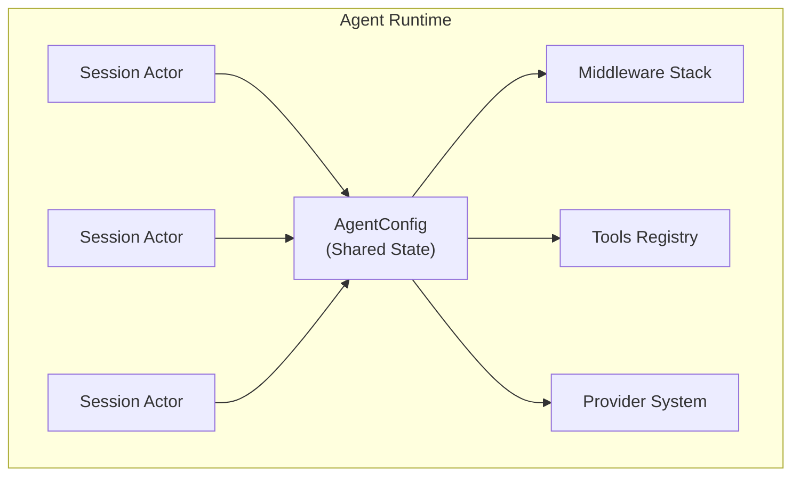
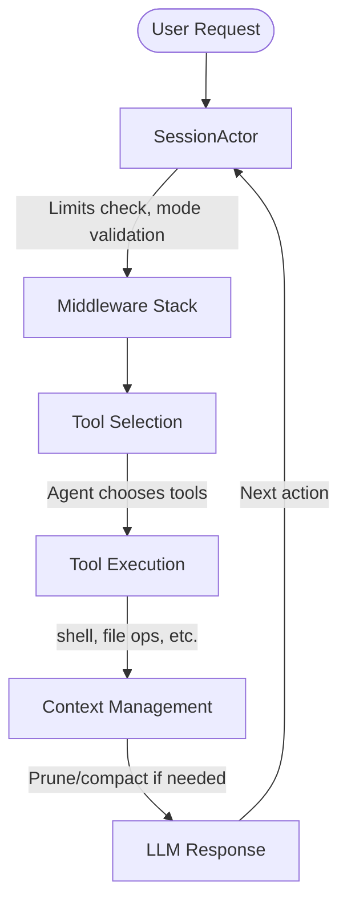
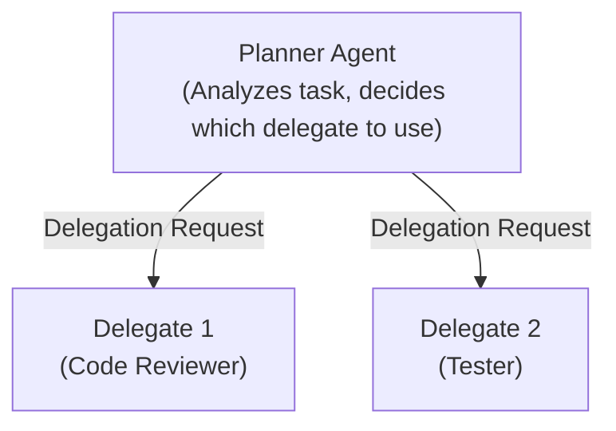

# QueryMT Agent - Overview

The `querymt-agent` crate is a high-level agent runtime for QueryMaTe, providing a flexible framework for building AI agents with support for single-agent and multi-agent (quorum) configurations.

## What is QueryMT Agent?

QueryMT Agent is a Rust library that enables you to:

- **Build AI agents** with configurable tools, models, and behaviors
- **Run agents in multiple modes**: ACP stdio, web dashboard, or mesh networking
- **Support multi-agent workflows** with planner-delegate delegation patterns
- **Manage context efficiently** with automatic compaction and pruning
- **Enable cross-machine collaboration** via libp2p mesh networking

## Architecture Overview



### Core Components

#### 1. AgentConfig
The central configuration structure containing:
- **Provider**: LLM provider configuration (Anthropic, OpenAI, etc.)
- **Tool Registry**: Available tools (built-in, MCP, provider-specific)
- **Middleware Stack**: Processing pipeline for agent decisions
- **Event Sink**: Event publishing and subscription
- **Session Provider**: Session management and history storage

#### 2. SessionActor
Per-session runtime state managed as a kameo actor:
- **Execution State**: Current turn, step count, tool usage
- **Conversation Context**: Message history with compaction
- **Runtime State**: MCP tools, workspace index, permissions
- **Execution Permit**: Ensures FIFO ordering of prompts

#### 3. Middleware Stack
A pluggable processing pipeline that intercepts and modifies agent behavior:
- **LimitsMiddleware**: Step and turn limits
- **ContextMiddleware**: Token management and compaction
- **AgentModeMiddleware**: Mode-aware restrictions (build/plan/review)
- **DedupCheckMiddleware**: Duplicate code detection
- **DelegationMiddleware**: Multi-agent coordination

#### 4. Tool Registry
Unified tool system supporting:
- **Built-in tools**: `edit`, `read_tool`, `shell`, `glob`, etc.
- **Provider tools**: Tools exposed by the LLM provider
- **MCP tools**: Model Context Protocol servers

## Agent Modes

QueryMT Agent supports three runtime modes, switchable at runtime:

| Mode | Description | Use Case |
|------|-------------|----------|
| **Build** | Full read/write access | Implementing code changes |
| **Plan** | Read-only, planning focus | Analyzing and planning before implementation |
| **Review** | Read-only, code review | Reviewing code quality and providing feedback |

Switch modes with `Ctrl+M` (or `Cmd+M` on macOS) in dashboard mode.

## Execution Flow



## Multi-Agent (Quorum) Architecture

For complex tasks, QueryMT supports a planner-delegate pattern:



## Key Features

### Context Management

QueryMT implements a 3-layer context management system:

1. **Tool Output Truncation**: Limits tool output to configurable size
2. **Pruning**: Removes old tool results after every turn
3. **AI Compaction**: Summarizes history when context approaches limits

### Delegation System

- **Automatic delegation**: Agents can delegate tasks to specialized agents
- **Verification**: Optional verification of delegate results
- **Planning context**: Summarized context passed to delegates
- **Parallel execution**: Multiple delegations can run concurrently

### Mesh Networking

- **Cross-machine sessions**: Share sessions across multiple machines
- **Internet-capable transport**: iroh-based NAT traversal with invite tokens
- **Multi-transport**: LAN + Internet mesh simultaneously
- **Remote session management**: Forking, resuming, and recovery
- **Streaming stability**: Robust handling of network interruptions

### Profiles

- **Multiple configurations**: Switch between different agent setups instantly
- **Task-specific settings**: Different profiles for coding, reviewing, planning
- **Team collaboration**: Share profiles via version control
- **Session binding**: Sessions remember their profile

### Slash Commands

- **Custom commands**: Define commands in markdown files
- **Tab completion**: Fuzzy matching for fast command lookup
- **Argument substitution**: Dynamic prompts with `$1`, `$2`, `$ARGUMENTS`
- **Team sharing**: Share commands via `.qmt/commands/`

### Code Intelligence Tools

- **AST-aware analysis**: `index`, `get_symbol`, `get_function`
- **Safe refactoring**: `replace_symbol` with AST-based replacement
- **Symbol references**: `find_references` across codebase
- **Multi-language support**: Rust, Python, TypeScript, Go, Java, C/C++

### Scheduled Tasks

- **Interval schedules**: Run tasks at fixed intervals
- **Event-driven schedules**: Trigger on file changes, knowledge ingestion
- **Automation**: Background tasks for maintenance and analysis

## Getting Started

### Quick Start

```bash
# Run the coder agent example with dashboard
cd crates/agent
cargo run --example qmtcode --features dashboard -- --dashboard

# Run as ACP stdio server
cargo run --example qmtcode -- --acp
```

### Programmatic Usage

```rust
use querymt_agent::prelude::*;

#[tokio::main]
async fn main() -> Result<(), Box<dyn std::error::Error>> {
    // Create a single agent
    let agent = Agent::single()
        .provider("anthropic", "claude-sonnet-4-5-20250929")
        .cwd(".")
        .tools(["read_tool", "shell", "edit"])
        .build()
        .await?;

    // Chat with the agent
    let response = agent.chat("Hello!").await?;
    println!("{}", response);

    Ok(())
}
```

## Documentation Structure

- **Overview** (this document): Architecture and concepts
- **[Configuration Guide](configuration.md)**: TOML configuration reference
- **[Mesh Networking Guide](mesh.md)**: Cross-machine collaboration and internet mesh
- **[Profiles Guide](profiles.md)**: Save and switch between configurations
- **[Slash Commands Guide](slash-commands.md)**: Custom commands and workflows
- **[Delegation Guide](delegation.md)**: Multi-agent coordination
- **[Middleware Guide](middleware.md)**: Custom middleware development
- **[Agent Modes](agent_modes.md)**: Build, plan, and review modes
- **[Export Guide](export.md)**: Session export for fine-tuning
- **[API Reference](api_reference.md)**: Rust API documentation
- **[Examples](examples.md)**: Usage examples and patterns

## Related Documentation

- [QueryMaTe Main Documentation](https://docs.query.mt)
- [MCP Integration](../mcp.md) - Model Context Protocol
- [Agent Examples](examples.md)
- [Configuration Examples](configuration.md)
- [Configuration Examples](configuration.md)