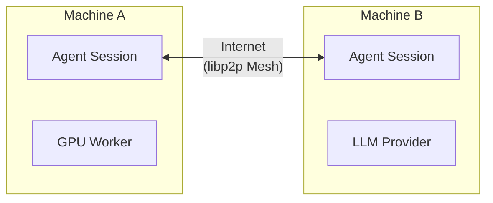
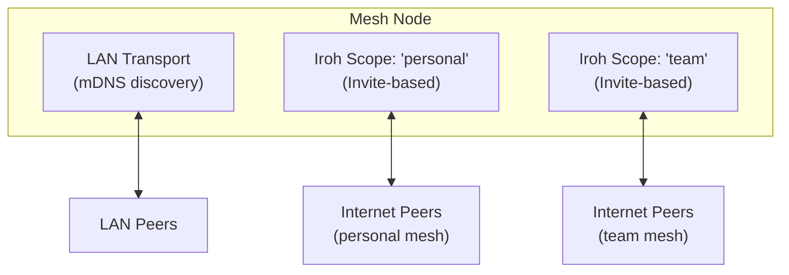
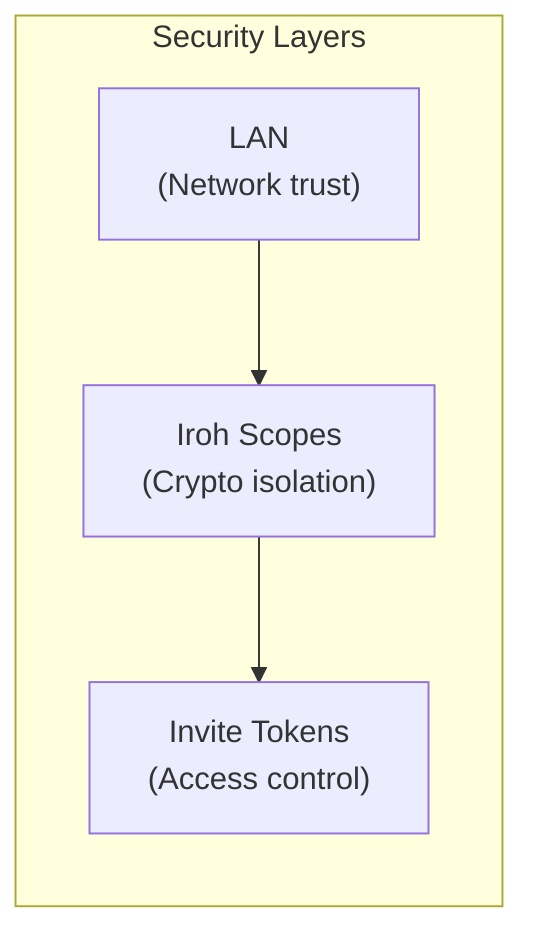
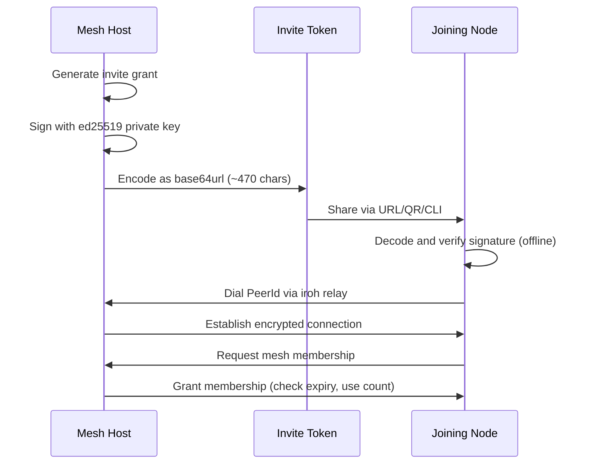
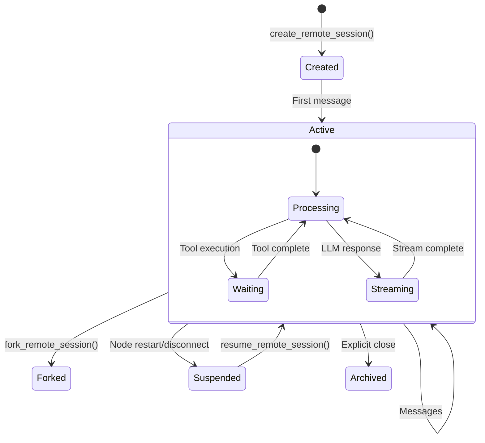
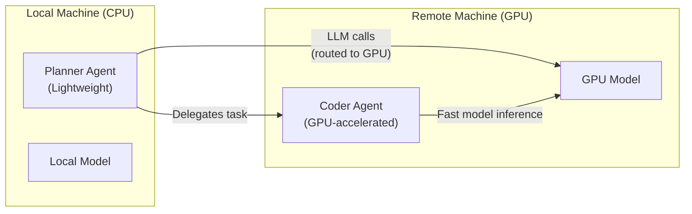
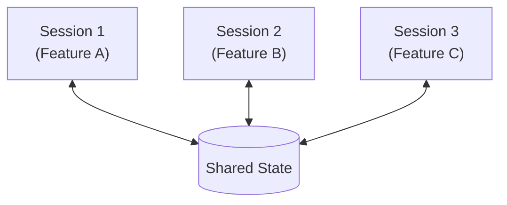
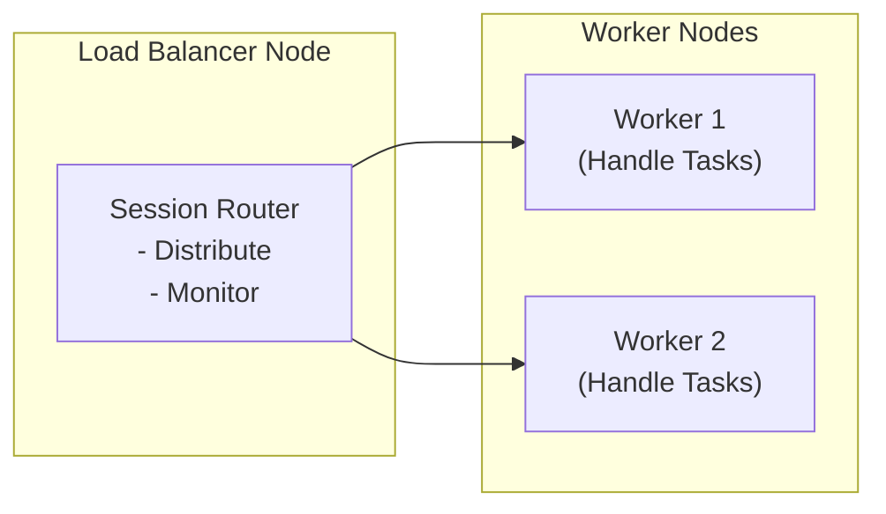
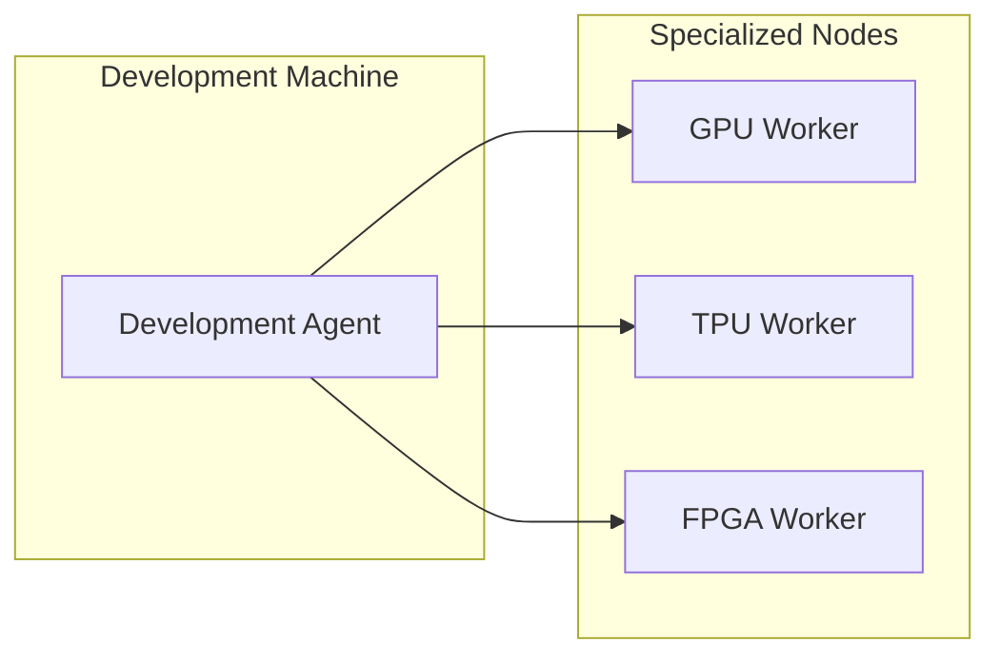
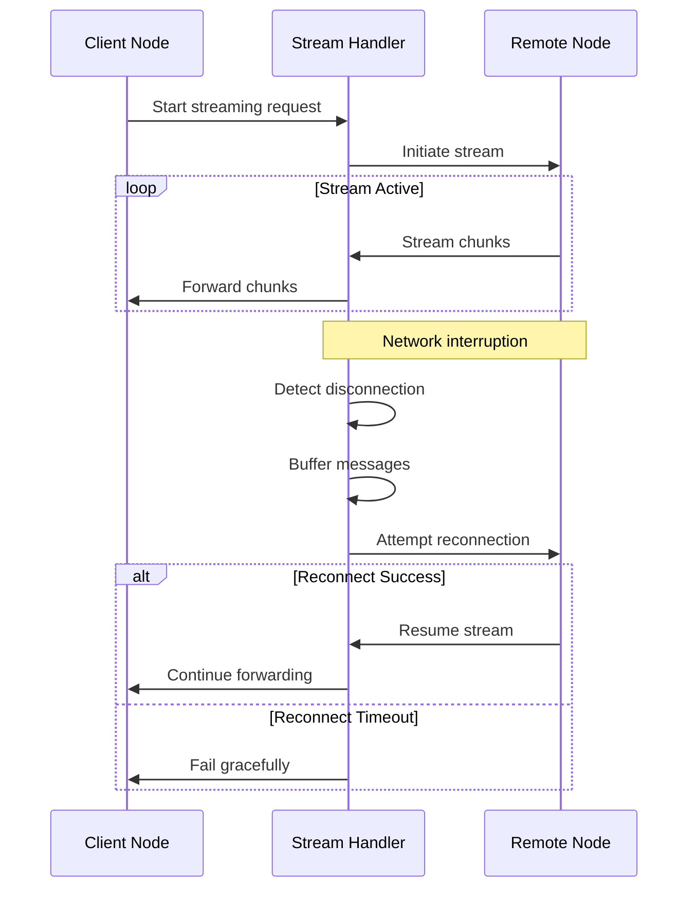

# QueryMT Agent - Mesh Networking

Mesh networking enables QueryMT Agent to collaborate across multiple machines, allowing sessions to be shared, delegates to run remotely, and LLM calls to be routed to specific nodes.

## Overview

Mesh networking uses the **kameo** actor framework with **libp2p** for peer-to-peer communication. This enables:

- **Cross-machine sessions**: Share sessions across multiple machines
- **Remote agents**: Access agents running on other machines
- **Distributed computation**: Run heavy tasks on specialized hardware
- **Load balancing**: Distribute work across multiple nodes

## Architecture



## Quick Start

### High-Level API

```rust
use querymt_agent::prelude::*;

let agent = Agent::single()
    .provider("anthropic", "claude-sonnet-4-5-20250929")
    .cwd(".")
    .tools(["read_tool", "shell", "edit"])
    .mesh(Mesh::hybrid())
    .build()
    .await?;

// Join an iroh mesh later without creating a second swarm.
agent.mesh().unwrap().join(invite_code).await?;
```

`Mesh::hybrid()` is the recommended default for API users. It starts one process-shared runtime with LAN discovery plus iroh transport enabled, so invites can be joined later on the same runtime.

### Starting a Mesh Node

```bash
# Start mesh node (default: /ip4/0.0.0.0/tcp/9000)
cargo run --example qmtcode --features remote -- --mesh

# Start on custom port
cargo run --example qmtcode --features remote -- --mesh=/ip4/0.0.0.0/tcp/9001

# Start with dashboard and mesh
cargo run --example qmtcode --features "dashboard remote" -- --dashboard --mesh
```

### Connecting to a Mesh

```bash
# Connect to specific peer
cargo run --example qmtcode --features remote -- --mesh=/ip4/192.168.1.100/tcp/9000
```

## Configuration

### Basic Mesh Configuration

```toml
[mesh]
enabled = true
listen = "/ip4/0.0.0.0/tcp/9000"  # Multiaddr to listen on
transport = "iroh"                 # Enable iroh transport for invite joins
discovery = "mdns"                 # "mdns" | "kademlia" | "none"
auto_fallback = false              # Allow mesh provider discovery
node_name = "my-agent-node"        # Optional: human-readable name
identity_file = "~/.qmt/mesh_identity.key"  # Optional: identity keypair

[mesh.lan]
enabled = true

# Explicit peers to connect to
[[mesh.peers]]
name = "dev-gpu"
addr = "/ip4/192.168.1.100/tcp/9000"

# Request timeout for non-streaming calls
request_timeout_secs = 300

# Grace period for stream reconnection
stream_reconnect_grace_secs = 120
```

This is the config equivalent of `Mesh::hybrid()`: LAN stays enabled, and iroh transport is available for ad-hoc invite joins.

### Configuration Reference

| Field | Type | Default | Description |
|-------|------|---------|-------------|
| `enabled` | bool | `false` | Enable mesh networking |
| `listen` | string | `/ip4/0.0.0.0/tcp/0` | Multiaddr to listen on |
| `transport` | string | `"lan"` | Transport layer: `"lan"` or `"iroh"` |
| `discovery` | string | `"mdns"` | Peer discovery method |
| `auto_fallback` | bool | `false` | Allow mesh provider discovery fallback |
| `node_name` | string | OS hostname | Human-readable node name advertised to peers |
| `identity_file` | string | `~/.qmt/mesh_identity.key` | Path to ed25519 identity keypair |
| `request_timeout_secs` | u64 | `300` | Timeout for non-streaming requests (seconds) |
| `stream_reconnect_grace_secs` | u64 | `120` | Grace period for stream reconnection (seconds) |
| `invite` | string | - | Invite token to join existing mesh (supports `${VAR}` interpolation) |

### Transport Modes

QueryMT supports two transport modes optimized for different network environments:

#### LAN Transport (Default)

Traditional TCP + QUIC transport optimized for local area networks:

```toml
[mesh]
enabled = true
transport = "lan"
```

**Characteristics:**
- ✅ **Fast**: Optimized for low-latency LAN connections
- ✅ **Zero-config discovery**: Automatic peer discovery via mDNS
- ✅ **Low overhead**: Direct TCP/QUIC connections
- ❌ **LAN only**: Cannot traverse NAT or connect over internet
- ❌ **Subnet limitations**: mDNS may not work across different subnets

**Use cases:**
- Development environments on local network
- Office networks with multiple machines
- High-bandwidth, low-latency requirements

#### Iroh Transport

Internet-capable transport with NAT traversal using the iroh networking library:

```toml
[mesh]
enabled = true
transport = "iroh"
```

**Characteristics:**
- ✅ **Internet-capable**: Works across the internet
- ✅ **NAT traversal**: Automatic hole punching and relay fallback
- ✅ **Encrypted**: Built-in encryption and authentication
- ✅ **Relay network**: Falls back to relay servers when direct connection fails
- ❌ **Higher latency**: Slightly higher overhead than direct LAN
- ❌ **Requires invite**: Typically uses invite tokens for secure joining

**Use cases:**
- Remote team collaboration
- Distributed nodes across different networks
- Nodes behind NAT or firewalls
- Cloud + on-premises hybrid setups

#### Comparison Table

| Feature | LAN Transport | Iroh Transport |
|---------|--------------|----------------|
| **Network** | Local network only | Internet-wide |
| **Discovery** | mDNS (automatic) | Invite tokens |
| **NAT Traversal** | No | Yes (hole punching + relay) |
| **Latency** | Very low | Low-medium |
| **Setup Complexity** | Minimal | Requires invite workflow |
| **Security** | Network-level | Built-in encryption |
| **Best For** | Development, LAN | Production, remote teams |

### Discovery Methods

#### mDNS (Default)

Automatic discovery on local network:

```toml
[mesh]
discovery = "mdns"
```

- **Pros**: Zero-config, automatic
- **Cons**: Local network only, may miss peers on different subnets

#### Kademlia DHT

Distributed discovery across the internet:

```toml
[mesh]
discovery = "kademlia"
```

- **Pros**: Cross-subnet, internet-wide
- **Cons**: Requires bootstrap nodes, more complex

#### Manual Peers

Explicit peer connections:

```toml
[mesh]
discovery = "none"

[[mesh.peers]]
name = "server1"
addr = "/ip4/192.168.1.100/tcp/9000"

[[mesh.peers]]
name = "server2"
addr = "/ip4/192.168.1.101/tcp/9000"
```

- **Pros**: Precise control, reliable
- **Cons**: Manual configuration required

#### Iroh Relay Discovery

Automatic discovery via iroh relay network (used with iroh transport):

```toml
[mesh]
transport = "iroh"
# Discovery is automatic via invite tokens and relay network
```

**How it works:**
1. Host creates invite token with embedded PeerId
2. Joiner connects to inviter via iroh relay
3. Relay network handles NAT traversal
4. Direct connection established when possible (hole punching)
5. Falls back to relay if direct connection fails

**Pros:**
- Works across the internet
- Automatic NAT traversal
- No manual peer configuration needed
- Encrypted by default

**Cons:**
- Requires invite token workflow
- Slightly higher latency than LAN
- Depends on iroh relay network availability

### Discovery Method Selection Guide

| Scenario | Recommended Method | Reason |
|----------|-------------------|--------|
| Development on local LAN | `mdns` + `lan` transport | Zero-config, automatic |
| Office network, multiple subnets | `kademlia` + `lan` transport | Cross-subnet discovery |
| Remote team, internet nodes | Invite tokens + `iroh` transport | NAT traversal, secure |
| Production, fixed infrastructure | `none` + explicit peers | Predictable, reliable |
| Mixed environment | Multi-transport (see below) | Best of both worlds |

## Multi-Transport Setup

QueryMT supports running multiple transports simultaneously, enabling nodes to participate in both LAN and internet meshes at the same time.

### Multi-Transport Architecture



### Basic Multi-Transport Configuration

```toml
[mesh]
enabled = true

# LAN transport configuration
[mesh.lan]
enabled = true
listen = "/ip4/0.0.0.0/tcp/0"
discovery = "mdns"

# Iroh scope 1: Personal mesh
[[mesh.iroh]]
enabled = true
name = "personal"
invite = "${QMT_PERSONAL_INVITE}"

# Iroh scope 2: Team mesh
[[mesh.iroh]]
enabled = true
name = "team"
invite = "${QMT_TEAM_INVITE}"
```

### Configuration Reference

#### LAN Subtable (`[mesh.lan]`)

```toml
[mesh.lan]
enabled = true                           # Enable LAN transport
listen = "/ip4/0.0.0.0/tcp/0"           # Multiaddr to listen on
discovery = "mdns"                       # "mdns" | "kademlia" | "none"
```

| Field | Type | Default | Description |
|-------|------|---------|-------------|
| `enabled` | bool | `false` | Enable LAN transport |
| `listen` | string | Inherited from `[mesh] listen` | LAN-specific listen address |
| `discovery` | string | Inherited from `[mesh] discovery` | LAN discovery method |

#### Iroh Scope Array (`[[mesh.iroh]]`)

```toml
[[mesh.iroh]]
enabled = true                           # Enable this Iroh scope
name = "scope-name"                      # Human-readable scope name (used as mesh_id)
invite = "${QMT_INVITE_TOKEN}"           # Invite token to join existing mesh
```

| Field | Type | Default | Description |
|-------|------|---------|-------------|
| `enabled` | bool | `false` | Enable this Iroh scope |
| `name` | string | - | Scope identifier (becomes mesh_id when no invite) |
| `invite` | string | - | Invite token to join existing mesh (supports `${VAR}`) |

### Multi-Transport Use Cases

#### Use Case 1: LAN + Personal Internet Mesh

Local development with ability to connect from home:

```toml
[mesh]
enabled = true

[mesh.lan]
enabled = true
discovery = "mdns"

[[mesh.iroh]]
enabled = true
name = "personal"
invite = "${QMT_HOME_INVITE}"
```

**Benefits:**
- Fast LAN connections for local machines
- Access from home via internet mesh
- Single node participates in both networks

#### Use Case 2: Multiple Team Meshes

Participate in multiple internet meshes:

```toml
[mesh]
enabled = true

[[mesh.iroh]]
enabled = true
name = "engineering"
invite = "${QMT_ENG_INVITE}"

[[mesh.iroh]]
enabled = true
name = "data-science"
invite = "${QMT_DS_INVITE}"

[[mesh.iroh]]
enabled = true
name = "devops"
invite = "${QMT_DEVOPS_INVITE}"
```

**Benefits:**
- Single node accessible from multiple teams
- Team-specific mesh isolation
- Centralized node management

#### Use Case 3: LAN with Internet Fallback

Primary LAN mesh with internet access for remote workers:

```toml
[mesh]
enabled = true
auto_fallback = true  # Allow mesh provider discovery fallback

[mesh.lan]
enabled = true
listen = "/ip4/0.0.0.0/tcp/9000"
discovery = "mdns"

[[mesh.iroh]]
enabled = true
name = "remote-access"
invite = "${QMT_REMOTE_INVITE}"
```

### Multi-Transport Routing

When a node participates in multiple meshes, routing considers:

1. **Direct connections**: Prefer direct peer connections
2. **LAN priority**: LAN connections preferred over internet (lower latency)
3. **Scope matching**: Route to peers in same scope when possible
4. **Fallback**: Use relay if direct connection fails

```rust
// Routing considers all active transports
let routes = mesh.get_routes_for_peer(peer_id);
// Returns routes from all transports, ordered by priority
```

### Multi-Transport Security

Each transport maintains separate security context:

- **LAN**: Network-level security (same subnet trust)
- **Iroh scopes**: Cryptographic isolation between scopes
- **Invite tokens**: Per-scope access control
- **Identity**: Same node identity across all transports



### Migrating to Multi-Transport

#### From LAN-only to Multi-Transport

**Before (LAN only):**
```toml
[mesh]
enabled = true
listen = "/ip4/0.0.0.0/tcp/0"
discovery = "mdns"
```

**After (LAN + Internet):**
```toml
[mesh]
enabled = true

[mesh.lan]
enabled = true
listen = "/ip4/0.0.0.0/tcp/0"
discovery = "mdns"

[[mesh.iroh]]
enabled = true
name = "remote"
invite = "${QMT_REMOTE_INVITE}"
```

#### From Single Iroh to Multi-Transport

**Before (Single Iroh):**
```toml
[mesh]
enabled = true
transport = "iroh"
invite = "${QMT_INVITE}"
```

**After (Multiple Iroh scopes):**
```toml
[mesh]
enabled = true

[[mesh.iroh]]
enabled = true
name = "primary"
invite = "${QMT_PRIMARY_INVITE}"

[[mesh.iroh]]
enabled = true
name = "secondary"
invite = "${QMT_SECONDARY_INVITE}"
```

### Multi-Transport Best Practices

1. **Name scopes descriptively**: Use meaningful names for Iroh scopes
2. **Environment variables**: Store invites in env vars, not config files
3. **Scope isolation**: Keep different teams/projects in separate scopes
4. **Monitor connectivity**: Check all transports are healthy
5. **Test failover**: Verify behavior when one transport fails
6. **Document topology**: Keep track of which nodes are in which scopes

## Multiaddr Format

Mesh addresses use libp2p multiaddr format:

```
/ip4/<IP>/tcp/<PORT>     # TCP over IPv4
/ip6/<IP>/tcp/<PORT>     # TCP over IPv6
/udp/<PORT>/quic         # QUIC over UDP
/p2p/<PEER_ID>           # Direct peer connection
```

### Examples

```bash
# Listen on all interfaces, port 9000
--mesh=/ip4/0.0.0.0/tcp/9000

# Listen on specific interface
--mesh=/ip4/192.168.1.100/tcp/9000

# Random port (OS-assigned)
--mesh=/ip4/0.0.0.0/tcp/0

# QUIC transport
--mesh=/udp/9000/quic
```

## Invite Token System

QueryMT provides a secure invite token system for dynamically joining meshes, particularly useful for internet-capable iroh transport. This system uses cryptographic signatures to ensure only authorized nodes can join.

### Overview

Invite tokens are **signed grants** that allow nodes to securely join an existing mesh:

- **Cryptographically signed**: Each invite is signed with the host's ed25519 identity keypair
- **Self-verifying**: Joiners can verify the signature offline (no network required)
- **Time-limited**: Tokens expire after configurable duration (default: 24 hours)
- **Use-limited**: Tokens can be single-use or have a maximum use count
- **Role-based**: Tokens grant specific permissions (member vs client role)
- **Shareable**: Compact format fits in QR codes or URLs

### Token Format

Invite tokens are encoded in multiple formats:

1. **Base64url string**: Compact string for CLI usage (~470 characters)
2. **QR code**: Scannable QR code (version 14, 73x73 pixels)
3. **URL format**: `qmt://mesh/join/<base64_token>`
4. **Direct CLI**: Pass token directly to `--mesh-join`

### Creating Invites

#### Via CLI

```bash
# Create invite token (prints token and starts as mesh host)
cargo run --example qmtcode --features remote -- --mesh --mesh-invite

# Create named mesh invite
cargo run --example qmtcode --features remote -- --mesh --mesh-invite="My Agent Mesh"

# Create invite with specific TTL (default: 24h)
cargo run --example qmtcode --features remote -- --mesh --mesh-invite --invite-ttl=7d

# Create invite with multiple uses (default: 1)
cargo run --example qmtcode --features remote -- --mesh --mesh-invite --invite-uses=10

# Unlimited uses
cargo run --example qmtcode --features remote -- --mesh --mesh-invite --invite-uses=0
```

#### Via TOML Configuration

```toml
[mesh]
enabled = true
transport = "iroh"
# Store invite in environment variable
invite = "${QMT_MESH_INVITE}"
```

### Joining via Invite Tokens

#### Via CLI

```bash
# Join using full token string
cargo run --example qmtcode --features remote -- --mesh-join=qmt://mesh/join/eyJpbnZ...

# Join using base64 token directly
cargo run --example qmtcode --features remote -- --mesh-join=eyJpbnZ...

# Join using environment variable
export QMT_MESH_INVITE="eyJpbnZ..."
cargo run --example qmtcode --features remote -- --mesh-join="${QMT_MESH_INVITE}"
```

#### Via TOML Configuration

```toml
[mesh]
enabled = true
# Join mode: when invite is set, transport auto-switches to "iroh"
invite = "${QMT_MESH_INVITE}"
```

### Invite Security Model

#### Ed25519 Identity Keypair

Each node has a persistent identity keypair:

- **Location**: `~/.qmt/mesh_identity.key` (configurable via `identity_file`)
- **Generated**: Automatically on first run
- **Persistent**: Same PeerId across restarts
- **Secure**: Private key never leaves the host

#### Signature Verification

The invite token verification process:

1. **Host creates invite**: Signs invite grant with ed25519 private key
2. **Token shared**: Base64url encoded token shared out-of-band
3. **Joiner receives token**: Decodes and extracts grant + signature
4. **Offline verification**: Verifies signature using inviter's public key (embedded in token)
5. **Connection attempt**: Dials inviter's PeerId via iroh relay network
6. **Mesh join**: Establishes encrypted connection and joins mesh



### Invite Grant Structure

```rust
pub struct InviteGrant {
    pub version: u8,              // Wire format version (3)
    pub invite_id: String,        // UUID v7 (time-ordered)
    pub inviter_peer_id: String,  // Host's PeerId
    pub mesh_name: Option<String>,// Human-readable mesh name
    pub expires_at: u64,          // Unix timestamp (0 = no expiry)
    pub max_uses: u32,            // Max uses (0 = unlimited)
    pub permissions: InvitePermissions,
}

pub struct InvitePermissions {
    pub can_invite: bool,         // Can create sub-invites?
    pub role: String,             // "member" or "client"
}
```

### QR Code Support

Invite tokens fit in QR codes for easy mobile sharing:

- **Size**: QR version 14 (73x73 pixels)
- **Capacity**: ~470 characters
- **Format**: `qmt://mesh/join/<base64_token>`

```rust
// Generate QR code for invite token
use querymt_agent::agent::remote::qr;

let qr_code = qr::generate_qr(&invite_token)?;
println!("{}", qr_code);
```

### Invite Management

#### Environment Variable Interpolation

TOML configuration supports `${VAR}` syntax for secure token storage:

```toml
[mesh]
enabled = true
invite = "${QMT_MESH_INVITE}"  # Reads from environment
```

```bash
export QMT_MESH_INVITE="eyJpbnZ..."
cargo run --features remote -- --mesh
```

#### Token Lifecycle

1. **Creation**: Host generates signed grant with TTL and use limits
2. **Distribution**: Token shared via secure channel (URL, QR, CLI)
3. **Verification**: Joiner verifies signature offline
4. **Connection**: Joiner connects via iroh relay network
5. **Validation**: Host checks expiry and use count
6. **Membership**: Joiner granted mesh access
7. **Revocation**: Token expires or use limit reached

### Example Workflows

#### Workflow 1: Quick Team Setup

```bash
# Machine A (host): Create invite
cargo run --example qmtcode --features remote -- --mesh --mesh-invite="Dev Team"
# Output: Invite token: qmt://mesh/join/eyJpbnZ...

# Machine B (joiner): Join via token
cargo run --example qmtcode --features remote -- --mesh-join=qmt://mesh/join/eyJpbnZ...
```

#### Workflow 2: QR Code Sharing

```bash
# Generate QR code (save to file)
cargo run --example qmtcode --features remote -- --mesh --mesh-invite > invite.txt
# Scan QR code with mobile app that opens qmt:// URL
```

#### Workflow 3: Environment Variable for CI/CD

```toml
# .env file (gitignored)
QMT_MESH_INVITE=eyJpbnZ...

# config.toml
[mesh]
enabled = true
invite = "${QMT_MESH_INVITE}"
```

### Best Practices

1. **Use short TTLs**: Default 24h is good for temporary access
2. **Limit uses**: Set `invite_uses=1` for single-use tokens
3. **Secure distribution**: Share tokens via encrypted channels
4. **Environment variables**: Store tokens in env vars, not config files
5. **Rotate tokens**: Create new tokens periodically
6. **Monitor usage**: Track invite acceptance in logs

### Security Considerations

✅ **Strong cryptography**: Ed25519 signatures (64 bytes)
✅ **Offline verification**: No network needed to verify token
✅ **Time-limited**: Tokens expire automatically
✅ **Use-limited**: Prevents token reuse
✅ **Role-based**: Granular permission control
✅ **Signed**: Tamper-proof (signature invalid if modified)
✅ **Auditable**: Each invite has unique ID for tracking

⚠️ **Token exposure**: Treat tokens like passwords - don't commit to git
⚠️ **Transport security**: Always use iroh (encrypted) for internet meshes
⚠️ **Revocation**: Tokens cannot be revoked before expiry (use short TTLs)

## Ad-Hoc Invite Join

Use ad-hoc joins when the agent is already running and you want to add a new iroh mesh scope later.

```rust
let mesh = agent.mesh().expect("agent built with mesh support");
let joined = mesh.join(invite_code).await?;

println!("joined mesh {} via {}", joined.mesh_id, joined.inviter_peer_id);
```

The returned `MeshJoinOutcome` reports:

- `mesh_id`: the derived logical scope id
- `mesh_name`: optional invite label
- `inviter_peer_id`: the inviter peer id from the invite
- `already_joined`: whether this join was idempotent

## Remote Agents

Define agents that run on remote mesh nodes:

```toml
# Mesh peer definition
[[mesh.peers]]
name = "gpu-server"
addr = "/ip4/192.168.1.100/tcp/9000"

# Remote agent configuration
[[remote_agents]]
id = "gpu-coder"
name = "GPU Coder"
description = "Coder running on GPU server with fast model"
peer = "gpu-server"
capabilities = ["gpu", "fast-model"]
```

### Remote Delegate

Delegates can run on remote nodes:

```toml
[[delegates]]
id = "remote-coder"
provider = "anthropic"
model = "claude-sonnet-4-5-20250929"
description = "Coder on remote GPU machine"
peer = "gpu-server"  # Routes LLM calls to remote node
tools = ["edit", "write_file", "shell"]
```

**Behavior:**
- LLM calls are routed to the remote node
- Tool execution happens locally on the planner node
- Enables "remote model, local session" pattern

## Identity Management

Each mesh node has a persistent cryptographic identity that ensures stable PeerId across restarts.

### Identity Keypair

- **Algorithm**: Ed25519 (elliptic curve)
- **Location**: `~/.qmt/mesh_identity.key` (configurable)
- **Persistence**: Same PeerId across restarts
- **Auto-generation**: Created automatically on first run

### Configuration

```toml
[mesh]
enabled = true
identity_file = "~/.qmt/mesh_identity.key"  # Default location
```

### Custom Identity Path

```toml
[mesh]
enabled = true
identity_file = "/etc/querymt/mesh.key"  # System-wide
# Or relative to config directory
identity_file = "./mesh.key"
```

### Identity Management Best Practices

1. **Backup identity**: Copy `~/.qmt/mesh_identity.key` to preserve PeerId
2. **Secure storage**: Protect identity file (chmod 600)
3. **Don't share**: Identity contains private key
4. **Regeneration**: Delete file to generate new identity (changes PeerId)

### Node Name

Override the default hostname advertised to peers:

```toml
[mesh]
enabled = true
node_name = "gpu-server-01"  # Human-readable name
```

Useful when:
- OS hostname is meaningless (e.g., "unknown" on mobile)
- Multiple nodes on same machine
- Want descriptive names for peers

## Session Management

### Creating Remote Sessions

```rust
use querymt_agent::prelude::*;

// Create session on remote node
let remote_session = agent
    .create_remote_session("gpu-server", "coder")
    .await?;

// Attach to remote session
let session = agent.attach_remote_session(remote_session).await?;

// Use session normally
let response = session.chat("Hello!").await?;
```

### Listing Remote Nodes

Use `list_remote_nodes()` to discover available mesh peers and their capabilities:

```rust
// List available mesh nodes
let nodes = agent.list_remote_nodes().await;
// Returns Vec<NodeInfo> with peer_id, name, scopes, and provider info
```

### Attaching Existing Sessions

Attach to a session running on another node via the dashboard UI or the `attach_remote_session` API.

### Forking Sessions

Create a copy of a remote session at a specific message point:

```rust
// Fork remote session at specific message
let response = agent
    .fork_remote_session(&node_manager_ref, source_session_id, message_id)
    .await?;
```

**Use cases:**
- **Branching conversations**: Try different approaches from same starting point
- **Experimentation**: Fork to test risky changes without affecting original
- **Collaboration**: Team members fork to work on different aspects
- **Rollback**: Fork from known good state if current path isn't working

### Resuming Sessions

Reconnect to sessions across node restarts or disconnections:

```rust
// Resume existing session by ID
let response = agent
    .resume_remote_session(&node_manager_ref, session_id)
    .await?;
```

**Session recovery features:**
- **Automatic reconnection**: Handles transient network failures
- **State preservation**: Session state persisted across restarts
- **History recovery**: Full conversation history maintained
- **Graceful degradation**: Continues working even if some peers unavailable

### Remote Session Lifecycle



### Session Persistence

Remote sessions are persisted on the host node:

```toml
# On remote node (host)
[agent]
db = "/path/to/sessions.db"  # Session storage
```

**Persistence features:**
- **SQLite storage**: Sessions stored in SQLite database
- **History preservation**: Full message history with metadata
- **Tool results**: Tool execution results preserved
- **Context snapshots**: Compacted context stored for recovery

### Error Handling

#### Connection Failures

Remote operations may fail due to network issues, peer unavailability, or timeout. Check logs for specific error details and adjust `request_timeout_secs` or `stream_reconnect_grace_secs` as needed.

#### Stream Disconnections

```rust
// Configure graceful handling
[mesh]
stream_reconnect_grace_secs = 120  # Wait 2 minutes for reconnection
```

During stream disconnection:
1. **Buffer messages**: Messages buffered locally
2. **Attempt reconnect**: Automatic reconnection attempts
3. **Grace period**: Configurable wait time (default: 120s)
4. **Resume or fail**: Either reconnects successfully or fails gracefully

### Best Practices for Remote Sessions

1. **Use descriptive session IDs**: Makes it easier to resume
2. **Regular checkpoints**: Fork sessions before major changes
3. **Monitor node health**: Check node availability before delegation
4. **Handle failures gracefully**: Implement fallback to local execution
5. **Set appropriate timeouts**: Balance responsiveness vs reliability
6. **Use session names**: Add metadata to identify sessions

## Routing

### Routing Table

The mesh maintains a routing table that maps agents to nodes:

```rust
pub struct RoutingPolicy {
    pub agent_id: String,
    pub provider_target: RouteTarget,
    pub resolved_provider_node_id: Option<String>,
}

pub enum RouteTarget {
    Local,           // Run locally
    Peer(String),    // Run on specific peer
    Any,             // Run on any available peer
}
```

### Routing Snapshot

```rust
// Load routing snapshot
let snapshot = routing_handle.load();

// Get routing policy for an agent
if let Some(policy) = snapshot.get(&agent_id) {
    match &policy.provider_target {
        RouteTarget::Peer(peer_id) => {
            // Route LLM calls to peer
        }
        RouteTarget::Local => {
            // Run locally
        }
        RouteTarget::Any => {
            // Use any available node
        }
    }
}
```

## Use Cases

### 1. GPU-Accelerated Coding



**Configuration:**
```toml
[mesh]
enabled = true

[[mesh.peers]]
name = "gpu-server"
addr = "/ip4/192.168.1.100/tcp/9000"

[[delegates]]
id = "gpu-coder"
provider = "anthropic"
model = "claude-sonnet-4"
peer = "gpu-server"
tools = ["edit", "write_file", "shell"]
```

### 2. Distributed Team Collaboration



**Benefits:**
- Share session state across team members
- Collaborate on same codebase
- Real-time synchronization

### 3. Load Distribution



**Configuration:**
```toml
[mesh]
enabled = true
discovery = "kademlia"

[[mesh.peers]]
name = "worker1"
addr = "/ip4/10.0.0.1/tcp/9000"

[[mesh.peers]]
name = "worker2"
addr = "/ip4/10.0.0.2/tcp/9000"
```

### 4. Specialized Hardware



## Streaming Stability

QueryMT includes robust streaming stability features for handling network interruptions and maintaining reliable LLM streaming across the mesh.

### Stream Reconnection

When a remote streaming connection is interrupted, QueryMT automatically attempts reconnection:

```toml
[mesh]
# Grace period for stream reconnection (default: 120 seconds)
stream_reconnect_grace_secs = 120
```

**Reconnection behavior:**

1. **Detection**: Stream interruption detected via heartbeat timeout
2. **Buffering**: Messages buffered locally during disconnection
3. **Reconnection attempts**: Automatic reconnection with exponential backoff
4. **Grace period**: Configurable wait time before failing (default: 120s)
5. **Resume or fail**: Stream resumes or fails gracefully after timeout



### Streaming Timeouts

QueryMT distinguishes between different timeout scenarios for better reliability:

#### Request Timeout

Timeout for non-streaming mesh requests (e.g., compaction, metadata queries):

```toml
[mesh]
# Timeout for non-streaming requests (default: 300 seconds = 5 minutes)
request_timeout_secs = 300
```

**Use cases:**
- Agent metadata queries
- Session operations (create, fork, list)
- Model listing
- Node info requests

#### Streaming Behavior

For streaming LLM responses:

- **First-chunk timeout**: The mesh waits for the first response chunk after initiating a stream
- **Idle detection**: Monitors for stalled streams during streaming
- **Reconnection**: If a stream disconnects, the system attempts reconnection within the `stream_reconnect_grace_secs` window

These behaviors are managed internally by the mesh transport. Configure the grace period for reconnection:

```toml
[mesh]
stream_reconnect_grace_secs = 120  # Wait 2 minutes for reconnection (default)
```

### Transient Disconnect Handling

QueryMT gracefully handles temporary network issues:

#### Symptoms of Transient Disconnects

- Brief network interruptions (WiFi switching, VPN reconnect)
- Packet loss
- Temporary DNS failures
- NAT re-binding

#### Handling Strategy

```rust
// Automatic retry with backoff
const MAX_RETRIES: usize = 3;
const INITIAL_BACKOFF: Duration = Duration::from_secs(1);

for attempt in 0..MAX_RETRIES {
    match send_request().await {
        Ok(response) => return Ok(response),
        Err(e) if e.is_transient() => {
            let backoff = INITIAL_BACKOFF * 2u32.pow(attempt as u32);
            tokio::time::sleep(backoff).await;
            continue;
        }
        Err(e) => return Err(e),
    }
}
```

#### Configuration for Unstable Networks

For networks with frequent interruptions:

```toml
[mesh]
# Increase timeouts for unreliable networks
request_timeout_secs = 600  # 10 minutes
stream_reconnect_grace_secs = 300  # 5 minutes
```

### Mesh Provider Stability

For remote model providers in the mesh:

#### Fallback Strategies

Configure automatic fallback when remote providers fail:

```toml
[mesh]
# Allow fallback to mesh provider discovery
auto_fallback = true
```

**Fallback chain:**
1. Try primary remote provider
2. If unavailable, try other providers in mesh
3. If all remote providers fail, use local provider
4. If local provider fails, return error

### Monitoring Stream Health

#### Log Monitoring

Enable detailed stream logging:

```bash
# Enable mesh stream logging
RUST_LOG=querymt_agent::agent::remote=debug cargo run --features remote -- --mesh

# Enable all libp2p logging
RUST_LOG=libp2p=info,querymt=debug cargo run --features remote -- --mesh
```

**Key log messages:**
- `Stream reconnected successfully` - Good
- `Stream reconnection timeout` - Check network
- `Provider health check failed` - Provider issue
- `Transient disconnect detected` - Network instability

#### Metrics to Watch

| Metric | Healthy | Warning | Critical |
|--------|---------|---------|----------|
| Stream reconnection rate | < 1% | 1-5% | > 5% |
| Average latency | < 100ms | 100-500ms | > 500ms |
| Provider availability | > 99% | 95-99% | < 95% |
| Error rate | < 0.1% | 0.1-1% | > 1% |

### Best Practices for Streaming Stability

1. **Set appropriate timeouts**: Balance responsiveness vs reliability
   - Fast networks: Lower timeouts (30-60s)
   - Slow/unreliable: Higher timeouts (120-300s)

2. **Monitor reconnection rates**: High rates indicate network issues

3. **Use health checks**: Implement periodic provider health checks

4. **Implement client-side buffering**: Buffer messages during reconnection

5. **Provide user feedback**: Show reconnection status in UI

6. **Test network resilience**: Simulate network failures in testing

7. **Log stream events**: Enable detailed logging for debugging

8. **Configure per-network**: Adjust settings for different network conditions

9. **Use exponential backoff**: Prevent thundering herd on reconnection

10. **Graceful degradation**: Fall back to local execution when mesh fails

### Troubleshooting Streaming Issues

#### Symptom: Frequent Stream Timeouts

**Possible causes:**
- Network latency too high
- Remote node overloaded
- Timeout values too low

**Solutions:**
1. Increase `stream_reconnect_grace_secs`
2. Check remote node health
3. Reduce mesh complexity
4. Use closer geographic nodes

#### Symptom: Stream Never Reconnects

**Possible causes:**
- Network partition
- Remote node crashed
- Identity mismatch

**Solutions:**
1. Check network connectivity
2. Verify remote node is running
3. Check mesh peer configuration
4. Restart mesh on affected nodes

#### Symptom: High Latency During Streaming

**Possible causes:**
- Network congestion
- Too many hops in mesh
- Provider overload

**Solutions:**
1. Check bandwidth utilization
2. Optimize mesh topology
3. Load balance across providers
4. Use LAN transport when possible

## Security

### Peer Authentication

Mesh nodes authenticate using libp2p's built-in peer ID system:

```rust
// Each node has a unique peer ID
let peer_id = mesh.peer_id();

// Connections are authenticated
// Only known peers can connect
```

### Firewall Configuration

Required ports for mesh networking:

| Direction | Port | Protocol | Purpose |
|-----------|------|----------|---------|
| Inbound | 9000 (default) | TCP | Mesh connections |
| Outbound | Any | TCP/UDP | Peer discovery |

**Example firewall rules:**

```bash
# Allow inbound mesh connections
ufw allow 9000/tcp

# Allow outbound connections
ufw allow out 9000/tcp
```

### NAT Traversal

For nodes behind NAT:

1. **Port forwarding**: Forward mesh port to internal node
2. **UPnP**: Enable UPnP for automatic port forwarding
3. **Relay**: Use libp2p relay servers

## Monitoring

### Node Status

```rust
// Get local node info
let peer_id = mesh.peer_id();
let listen_addrs = mesh.listen_addresses();

println!("Local peer ID: {}", peer_id);
println!("Listening on: {:?}", listen_addrs);

// Get connected peers
let peers = mesh.connected_peers().await;
println!("Connected to {} peers", peers.len());
```

### Event Logging

Enable mesh logging:

```bash
# Enable libp2p logging
RUST_LOG=libp2p=info cargo run --features remote -- --mesh
```

### Metrics

Key metrics to monitor:

- **Connected peers**: Number of active connections
- **Latency**: Round-trip time to peers
- **Bandwidth**: Data transfer rates
- **Session count**: Number of sessions per node

## Troubleshooting

### Cannot Connect to Peer

**Symptoms:** Mesh node shows no connected peers

**Solutions:**
1. Check firewall allows mesh port
2. Verify peer address is correct
3. Ensure peer is running and listening
4. Check NAT/firewall configuration

### High Latency

**Symptoms:** Slow responses from remote agents

**Solutions:**
1. Check network bandwidth
2. Reduce mesh complexity (fewer peers)
3. Use closer geographic nodes
4. Increase `request_timeout_secs`

### Peer Discovery Issues

**Symptoms:** Cannot find peers automatically

**Solutions:**
1. Try explicit peer configuration
2. Check mDNS is enabled on network
3. Verify firewall allows multicast
4. Use Kademlia for cross-subnet discovery

### Session Attachment Fails

**Symptoms:** Cannot attach to remote session

**Solutions:**
1. Verify session exists on remote node
2. Check peer has correct permissions
3. Ensure mesh is properly configured
4. Review error logs for details

## Best Practices

### Network Configuration

1. **Use static IPs** for mesh nodes
2. **Configure port forwarding** for NAT environments
3. **Monitor bandwidth** usage
4. **Use dedicated ports** for mesh traffic

### Node Organization

1. **Group by function**: Separate planner and worker nodes
2. **Consider geography**: Place nodes close to users
3. **Plan for redundancy**: Multiple nodes for critical tasks
4. **Document topology**: Keep track of node roles

### Security

1. **Use strong peer IDs**: Generate unique keys
2. **Limit peer access**: Only allow known peers
3. **Monitor connections**: Watch for unauthorized access
4. **Encrypt traffic**: Use TLS where possible

## Examples

### Full Mesh Configuration

```toml
[mesh]
enabled = true
listen = "/ip4/0.0.0.0/tcp/9000"
discovery = "mdns"
auto_fallback = false
request_timeout_secs = 300

[[mesh.peers]]
name = "dev-gpu"
addr = "/ip4/192.168.1.100/tcp/9000"

[[mesh.peers]]
name = "build-server"
addr = "/ip4/192.168.1.101/tcp/9000"

[[remote_agents]]
id = "gpu-coder"
name = "GPU Coder"
description = "Coder on GPU machine"
peer = "dev-gpu"
capabilities = ["gpu"]

[[delegates]]
id = "gpu-coder-delegate"
provider = "anthropic"
model = "claude-sonnet-4"
peer = "dev-gpu"
tools = ["edit", "write_file", "shell"]
```

### Command Line Examples

```bash
# Start as mesh node
cargo run --features remote -- --mesh

# Start with specific address
cargo run --features remote -- --mesh=/ip4/0.0.0.0/tcp/9001

# Start with dashboard and mesh
cargo run --features "dashboard remote" -- --dashboard --mesh

# Connect to specific peer
cargo run --features remote -- --mesh=/ip4/192.168.1.100/tcp/9000
```

## Related Documentation

- [Configuration Guide](configuration.md) - Mesh configuration options
- [Profiles](profiles.md) - Mesh-enabled profiles
- [Delegation](delegation.md) - Remote delegation patterns
- [Examples](examples.md) - Mesh networking examples
- [API Reference](api_reference.md) - Mesh API types and functions
