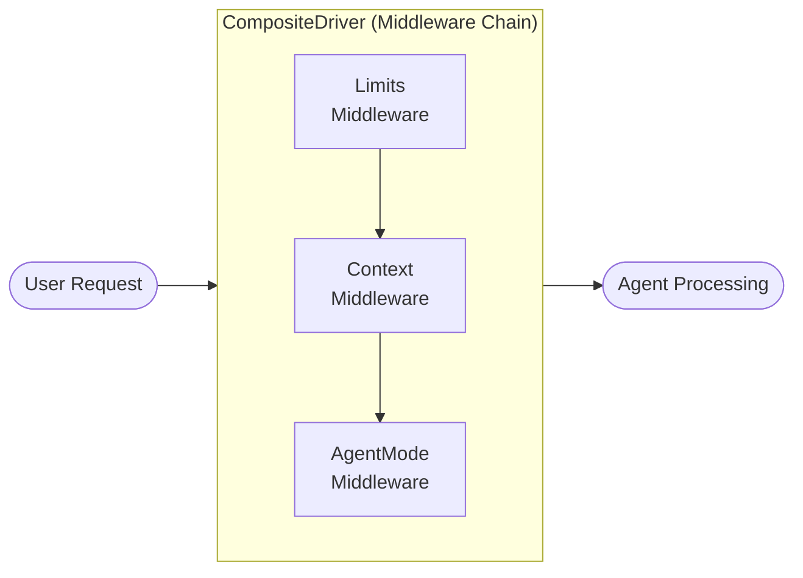
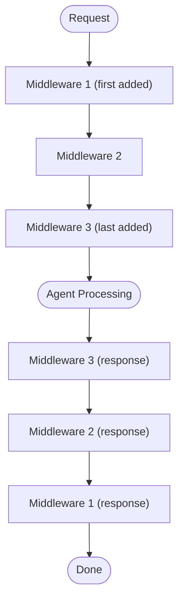

# QueryMT Agent - Middleware System

Middleware in QueryMT Agent provides a pluggable way to extend and modify agent behavior. The middleware system processes requests, responses, tool calls, and tool results through a configurable chain of handlers.

## Architecture

The middleware system uses a **driver-based architecture** where each middleware implements the `MiddlewareDriver` trait. Multiple drivers are chained together in a `CompositeDriver` that processes each agent interaction.



## Middleware Driver Trait

All middleware must implement the `MiddlewareDriver` trait:

```rust
pub trait MiddlewareDriver: Send + Sync {
    /// Unique name for this middleware
    fn name(&self) -> &str;
    
    /// Process incoming request (before agent processes)
    fn process_request(&self, request: &mut Request) -> Result<()>;
    
    /// Process outgoing response (after agent processes)
    fn process_response(&self, response: &mut Response) -> Result<()>;
    
    /// Process tool call (before tool execution)
    fn process_tool_call(&self, tool_call: &mut ToolCall) -> Result<()>;
    
    /// Process tool result (after tool execution)
    fn process_tool_result(&self, result: &mut ToolResult) -> Result<()>;
}
```

## Built-in Middleware

### LimitsMiddleware

Enforces execution limits on agent operations.

**Configuration:**
```toml
[[middleware]]
type = "limits"
max_steps = 200
max_turns = 50
```

**Features:**
- `max_steps`: Maximum tool calls per session
- `max_turns`: Maximum conversation turns
- `price_limit`: Maximum cost (if provider supports)

**Behavior:**
- Tracks step and turn counts
- Rejects requests when limits exceeded
- Provides clear error messages

### ContextMiddleware

Manages conversation context and token usage.

**Configuration:**
```toml
[[middleware]]
type = "context"
warn_at_percent = 80
compact_at_percent = 90
fallback_max_tokens = 128000
```

**Features:**
- `warn_at_percent`: Trigger warning at this % of context limit
- `compact_at_percent`: Trigger compaction at this %
- `fallback_max_tokens`: Fallback context limit

**Behavior:**
- Monitors token usage
- Triggers compaction when approaching limits
- Emits warnings for monitoring

### AgentModeMiddleware

Enforces mode-specific restrictions (build/plan/review).

**Configuration:**
```toml
[[middleware]]
type = "agent_mode"
default = "build"
reminder = """<system-reminder>
You are in plan mode. Read-only access.
</system-reminder>"""
review_reminder = """<system-reminder>
You are in review mode. Provide feedback only.
</system-reminder>"""
```

**Features:**
- `default`: Default mode on session start
- `reminder`: System message for plan mode
- `review_reminder`: System message for review mode

**Behavior:**
- Injects mode-specific reminders
- Restricts tool access based on mode
- Allows runtime mode switching

### DedupCheckMiddleware

Detects duplicate or similar code patterns.

**Configuration:**
```toml
[[middleware]]
type = "dedup_check"
threshold = 0.85
min_lines = 10
```

**Features:**
- `threshold`: Similarity threshold (0.0 - 1.0)
- `min_lines`: Minimum lines to consider

**Behavior:**
- Analyzes code before writing
- Warns about similar existing code
- Helps avoid code duplication

### ContextFactory Middleware

Legacy context management middleware.

**Configuration:**
```toml
[[middleware]]
type = "context"
max_tokens = 128000
compact_on_overflow = true
```

## Creating Custom Middleware

### Basic Middleware

```rust
use querymt_agent::middleware::{MiddlewareDriver, MiddlewareError, Result};
use querymt_agent::middleware::state::{ExecutionState, ToolCall, ToolResult};
use std::sync::Arc;

pub struct LoggingMiddleware {
    name: String,
}

impl LoggingMiddleware {
    pub fn new() -> Self {
        Self {
            name: "logging".to_string(),
        }
    }
}

impl MiddlewareDriver for LoggingMiddleware {
    fn name(&self) -> &str {
        &self.name
    }
    
    fn process_request(&self, request: &mut Request) -> Result<()> {
        log::info!("Request: {:?}", request);
        Ok(())
    }
    
    fn process_response(&self, response: &mut Response) -> Result<()> {
        log::info!("Response: {:?}", response);
        Ok(())
    }
    
    fn process_tool_call(&self, tool_call: &mut ToolCall) -> Result<()> {
        log::info!("Tool call: {}({})", 
            tool_call.function.name, 
            tool_call.function.arguments);
        Ok(())
    }
    
    fn process_tool_result(&self, result: &mut ToolResult) -> Result<()> {
        log::info!("Tool result: {} -> {} bytes", 
            result.tool_name, 
            result.result.len());
        Ok(())
    }
}
```

### Middleware with State

```rust
use std::sync::{Arc, Mutex};

pub struct RateLimitMiddleware {
    name: String,
    requests: Arc<Mutex<Vec<u64>>>,
    max_per_second: usize,
}

impl RateLimitMiddleware {
    pub fn new(max_per_second: usize) -> Self {
        Self {
            name: "rate_limit".to_string(),
            requests: Arc::new(Mutex::new(Vec::new())),
            max_per_second,
        }
    }
    
    fn cleanup_old_requests(&self) {
        let now = std::time::SystemTime::now()
            .duration_since(std::time::UNIX_EPOCH)
            .unwrap()
            .as_secs();
        
        let mut requests = self.requests.lock().unwrap();
        requests.retain(|&t| now - t < 1);
    }
}

impl MiddlewareDriver for RateLimitMiddleware {
    fn name(&self) -> &str {
        &self.name
    }
    
    fn process_request(&self, request: &mut Request) -> Result<()> {
        self.cleanup_old_requests();
        
        let mut requests = self.requests.lock().unwrap();
        if requests.len() >= self.max_per_second {
            return Err(MiddlewareError::rate_limit_exceeded(
                self.name().to_string()
            ));
        }
        requests.push(std::time::SystemTime::now()
            .duration_since(std::time::UNIX_EPOCH)
            .unwrap()
            .as_secs());
        
        Ok(())
    }
    
    // Other methods...
}
```

### Middleware with Configuration

```rust
use serde::{Deserialize, Serialize};
use serde_json::Value;

#[derive(Debug, Clone, Deserialize)]
pub struct MyMiddlewareConfig {
    pub enabled: bool,
    pub option1: String,
    pub option2: Option<usize>,
}

pub struct MyMiddleware {
    config: MyMiddlewareConfig,
}

impl MyMiddleware {
    pub fn new(config: MyMiddlewareConfig) -> Self {
        Self { config }
    }
}

impl MiddlewareDriver for MyMiddleware {
    fn name(&self) -> &str {
        "my_middleware"
    }
    
    fn process_request(&self, request: &mut Request) -> Result<()> {
        if !self.config.enabled {
            return Ok(());
        }
        
        // Custom logic here
        Ok(())
    }
    
    // Other methods...
}
```

## Registering Middleware

### Via Config File

```toml
[[middleware]]
type = "my_middleware"
enabled = true
option1 = "value1"
option2 = 42
```

### Programmatically

```rust
use querymt_agent::prelude::*;
use querymt_agent::middleware::MiddlewareDriver;

let agent = Agent::single()
    .provider("anthropic", "claude-sonnet-4-5-20250929")
    .cwd(".")
    .tools(["read_tool", "shell"])
    .middleware(LoggingMiddleware::new())
    .middleware(RateLimitMiddleware::new(10))
    .build()
    .await?;
```

## Middleware Factory Pattern

For config-based middleware creation, implement the `MiddlewareFactory` trait:

```rust
use querymt_agent::middleware::{MiddlewareFactory, MiddlewareDriver, Result};
use querymt_agent::agent::agent_config::AgentConfig;
use serde_json::Value;
use std::sync::Arc;

pub struct MyMiddlewareFactory;

impl MiddlewareFactory for MyMiddlewareFactory {
    fn type_name(&self) -> &'static str {
        "my_middleware"
    }
    
    fn create(
        &self,
        config: &Value,
        _agent_config: &AgentConfig,
    ) -> Result<Arc<dyn MiddlewareDriver>> {
        let config: MyMiddlewareConfig = serde_json::from_value(config.clone())
            .map_err(|e| anyhow::anyhow!("Invalid config: {}", e))?;
        
        Ok(Arc::new(MyMiddleware::new(config)))
    }
}

// Register the factory
use querymt_agent::middleware::MIDDLEWARE_REGISTRY;
MIDDLEWARE_REGISTRY.register(Arc::new(MyMiddlewareFactory));
```

## Middleware Execution Order

Middleware is executed in the order it was added to the chain:



## Common Patterns

### Request Validation

```rust
pub struct PermissionMiddleware {
    // ...
}

impl MiddlewareDriver for PermissionMiddleware {
    fn process_tool_call(&self, tool_call: &mut ToolCall) -> Result<()> {
        if self.requires_permission(&tool_call.function.name) {
            // Request permission from user
            let granted = self.request_permission()?;
            if !granted {
                return Err(MiddlewareError::permission_denied(
                    tool_call.function.name.clone()
                ));
            }
        }
        Ok(())
    }
}
```

### Response Modification

```rust
pub struct SanitizationMiddleware {
    // ...
}

impl MiddlewareDriver for SanitizationMiddleware {
    fn process_response(&self, response: &mut Response) -> Result<()> {
        // Remove sensitive information
        response.content = self.sanitize(&response.content);
        Ok(())
    }
}
```

### Tool Call Interception

```rust
pub struct ToolLoggingMiddleware {
    // ...
}

impl MiddlewareDriver for ToolLoggingMiddleware {
    fn process_tool_call(&self, tool_call: &mut ToolCall) -> Result<()> {
        // Log before execution
        self.log_tool_call(tool_call);
        
        // Modify arguments if needed
        if tool_call.function.name == "shell" {
            // Add safety prefix
            tool_call.function.arguments = self.sanitize_shell_args(
                &tool_call.function.arguments
            );
        }
        
        Ok(())
    }
}
```

## Error Handling

Middleware errors are categorized:

```rust
pub enum MiddlewareError {
    InternalError(String),
    ValidationError(String),
    PermissionDenied(String),
    RateLimitExceeded(String),
    ConfigError(String),
}
```

Errors can:
- **Block execution**: Return error to stop processing
- **Modify behavior**: Return Ok() with modified data
- **Log only**: Log and continue

## Best Practices

1. **Keep middleware focused**: Each middleware should do one thing well
2. **Be idempotent**: Middleware should produce same result on repeated runs
3. **Handle errors gracefully**: Don't crash the agent on middleware errors
4. **Log appropriately**: Use logging for debugging, not for every call
5. **Consider performance**: Avoid expensive operations in hot paths
6. **Document behavior**: Clearly document what each middleware does

## Troubleshooting

### Middleware Not Running

- Check middleware type is registered in `MIDDLEWARE_REGISTRY`
- Verify config has correct `type` field
- Check for config parsing errors in logs

### Middleware Order Issues

- Middleware executes in registration order
- Use `CompositeDriver` to control order explicitly
- Consider using middleware presets for common patterns

### Performance Issues

- Profile middleware execution time
- Avoid blocking operations in middleware
- Use async where possible
- Cache expensive computations

## Examples

See `examples/` for middleware usage:

- `qmtcode.rs` - Uses agent_mode, limits, context middleware
- Custom middleware examples in tests

## Related Documentation

- [Configuration Guide](configuration.md) - Configuring middleware
- [Agent Modes](agent_modes.md) - Mode-specific behavior
- [API Reference](api_reference.md) - Middleware types